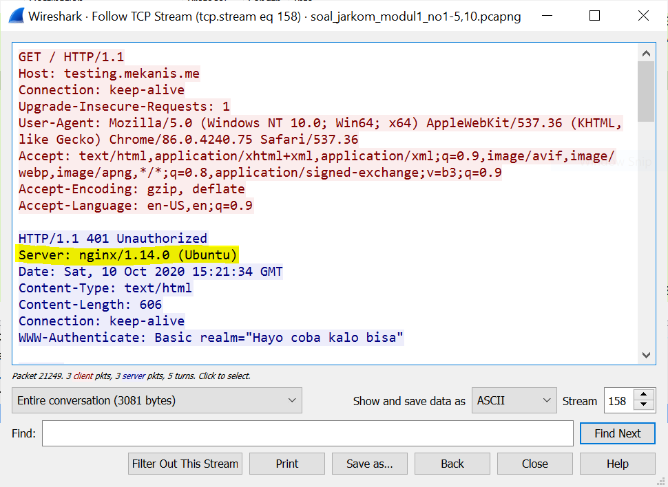
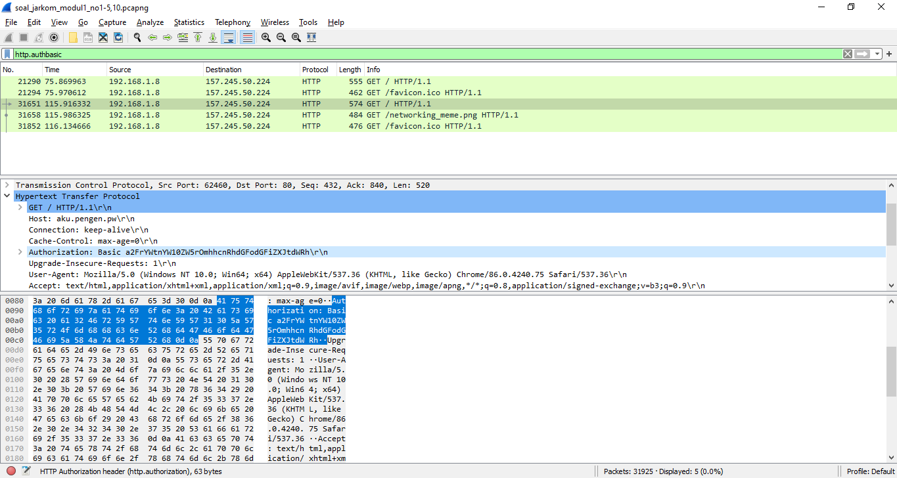
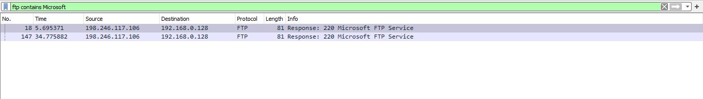
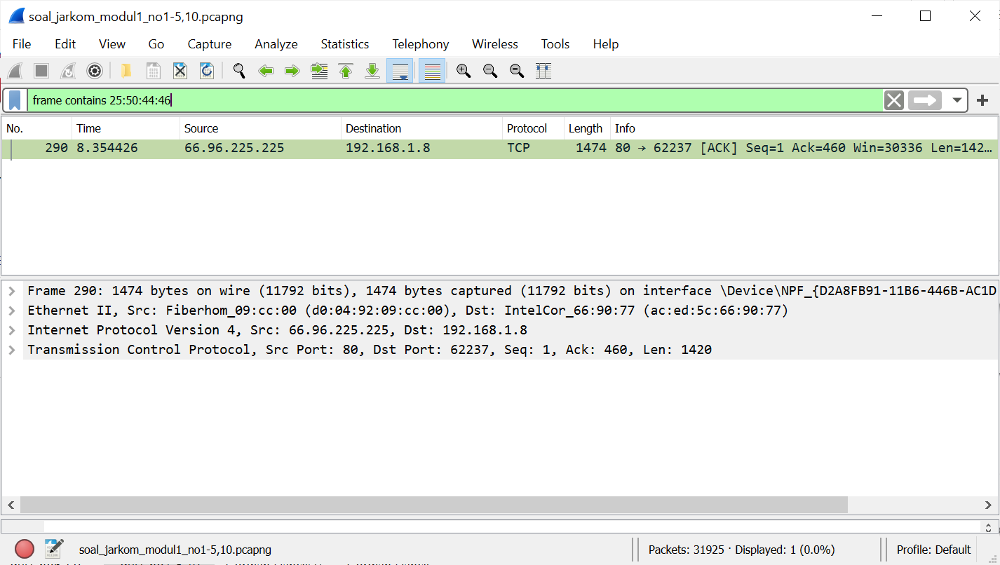

# Jarkom_Modul1_Lapres_C01
Praktikum Modul 1 Jaringan Komputer 2020

## Nama Anggota Kelompok :

**1. Devi Hainun Pasya (05111840000014)**

**2. Kevin Christian Hadinata (05111840000066)**


## A. Display Filter

### Soal No. 1
Sebutkan webserver yang digunakan pada "testing.mekanis.me"!

```
http.host contains "testing.mekanis.me"
```
Kemudian Analyze >> Follow >> TCP Stream

**HASIL :**



### Soal No. 2
Simpan gambar "Tim_Kunjungan_Kerja_BAKN_DPR_RI_ke_Sukabumi141436.jpg"!

```
http contains "Tim_Kunjungan_Kerja_BAKN_DPR_RI_ke_Sukabumi141436.jpg"
```
**KETERANGAN  :**
Setelah menemukan *packet* yang berisi file jpg yang dicari, maka kita dapat men-download file tersebut melalui File > Export Objects > HTML dan mencari nama *file*-nya untuk kemudian dapat di-*save* dalam bentuk jpg.

**HASIL :**


### Soal No. 3
Cari username dan password ketika login di "ppid.dpr.go.id"!

```
http.host contains "ppid.dpr.go.id" && http.request.method == POST
```

**HASIL :**


### Soal No. 4
Temukan paket dari **web-web** yang menggunakan **basic authentication** method!

```
http.authbasic
```
**KETERANGAN  :**
Di keterangan *Hypertext Transfer Protocol* bagian *Authorization* akan tertera tulisan *"Basic"*.

**HASIL :**



### Soal No. 5
Ikuti perintah di aku.pengen.pw! Username dan password bisa didapatkan dari file .pcapng!

```
http.authbasic && http contains “aku.pengen.pw”
```

**HASIL :**


### Soal No. 6
Seseorang menyimpan file zip melalui FTP dengan nama "Answer.zip". Simpan dan Buka file "Open This.pdf" di Answer.zip. Untuk mendapatkan password zipnya, temukan dalam file zipkey.txt (passwordnya adalah isi dari file txt tersebut).

```
- ftp-data.command contains "STOR Answer.zip"
- ftp-data.command contains "STOR zipkey.txt"
```
**KETERANGAN  :**
Ada kata kunci 'menyimpan' pada soal menandakan bahwa *file* yang dicari dapat di-*filter* menggunakan perintah STOR. Setelah menemukan *packet* yang dibutuhkan, kita dapat melakukan Follow > TCP Stream > Show and save data as RAW > Save as. Sementara itu, untuk zipkey.txt, *password* yang dicari akan terlihat saat membuka TCP Stream dari *packet* tersebut.

**HASIL :**


### Soal No. 7
Ada 500 file zip yang disimpan ke FTP Server dengan nama 1.zip, 2.zip, ..., 500.zip. Salah satunya berisi pdf yang berisi puisi. Simpan dan Buka file pdf tersebut.
Your Super Mega Ultra Rare Hint = nama pdf-nya "Yes.pdf"

```
frame contains “Yes.pdf”
```
Kemudian Analyze >> Follow >> TCP Stream >> Show and save data as "Raw" >> Save As..

**HASIL :**


### Soal No. 8
Cari objek apa saja yang didownload (RETR) dari koneksi FTP dengan Microsoft FTP Service!

```
- ftp contains Microsoft
- ftp.request.command == "RETR" && ip.dst_host 198.246.117.106
```

**KETERANGAN: **
*Display filter* yang pertama digunakan untuk mencari IP dari koneksi Microsoft FTP Service yang kemudian dipakai di *display filter* yang kedua.

**HASIL :**




### Soal No. 9
Cari username dan password ketika login FTP pada localhost!

```
ftp.request.command contains "USER" || ftp.request.command contains "PASS"
```

**HASIL :**


### Soal No. 10
Cari file .pdf di wireshark lalu download dan buka file tersebut!

clue: "25 50 44 46"

```
frame contains 25:50:44:46
```

**KETERANGAN  :**
Setelah menemukan *hex code* yang dicari, dapat di-*save* dengan cara Follow > TCP Stream > Show and save data as RAW > Save as.

**HASIL :**




## B. Capture Filter

### Soal No. 11
Filter sehingga wireshark hanya mengambil paket yang mengandung port 21!

```
port 21
```

**HASIL :**


### Soal No. 12
Filter sehingga wireshark hanya mengambil paket yang berasal dari port 80!

```
src port 80
```

**HASIL :**


### Soal No. 13
Filter sehingga wireshark hanya menampilkan paket yang menuju port 443!

```
dst port 443
```

**HASIL :**


### Soal No. 14
Filter sehingga wireshark hanya mengambil paket yang berasal dari ip kalian!

```
src host <ip kita>
```

**KETERANGAN  :**
Menggunakan *Command Prompt* lalu ipconfig untuk mendapatkan <IP kita>. 

**HASIL :**


### Soal No. 15
Filter sehingga wireshark hanya mengambil paket yang tujuannya ke monta.if.its.ac.id!

```
dst host monta.if.its.ac.id
```

**HASIL :**


